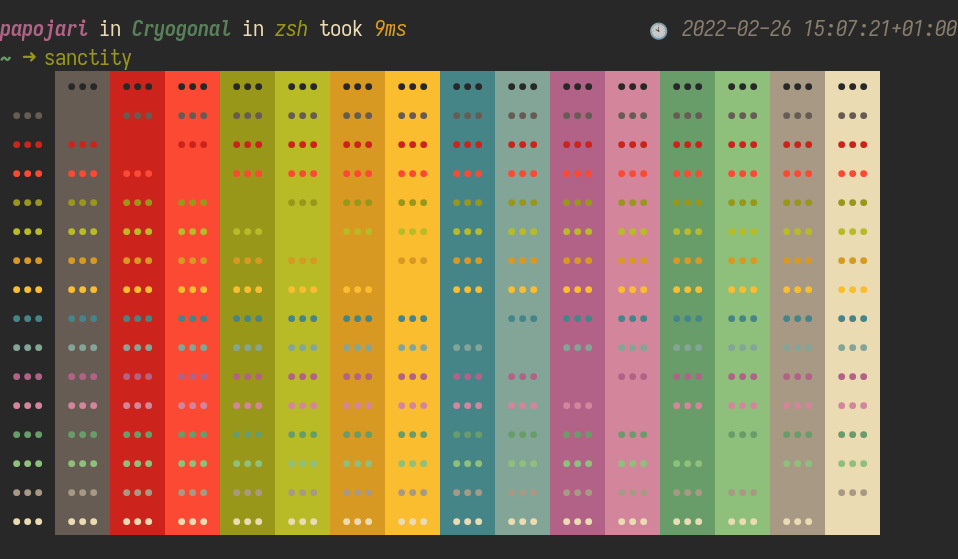

# sanctity 🌈

**sanctity** is an acronym for ru**s**t **an**si16 **c**olor **t**est ut**i**li**ty**.

It prints your own text or the default text in all of the 16 terminal colors. It does that 16 times, each time with another one of the colors as the background color.

You can also specify if the background colors should be in columns or rows.

## API

This program uses [Semantic Versioning](https://semver.org/). Therefore an API has to be defined:
The API or the means of interacting with this program are the the command line options and the command line output. Excluded are name, version and about in the `--help`.

If layouts are removed a major version will be released. However if layouts are added then that is considered backwards compatible and a major version will not be released.

So if changes are made to the exceptions then there will be no major or minor release because they are not part of the API. Thus if your program interacts with this one and uses features outside of the API you may expect them to break in between major releases.

## License

©️ 2022 papojari <mailto:papojari-git.ovoid@aleeas.com> <https://matrix.to/#/@papojari:artemislena.eu> <https://papojari.codeberg.page>

This program is free software: you can redistribute it and/or modify it under the terms of the GNU Lesser General Public License version 3 as published by the Free Software Foundation.

This program is distributed in the hope that it will be useful, but WITHOUT ANY WARRANTY; without even the implied warranty of MERCHANTABILITY or FITNESS FOR A PARTICULAR PURPOSE. See the GNU General Public License for more details.

You should have received a copy of the GNU Lesser General Public License version 3 along with this program. If not, see <https://www.gnu.org/licenses/>.

